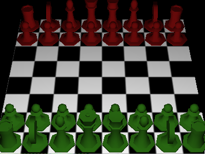
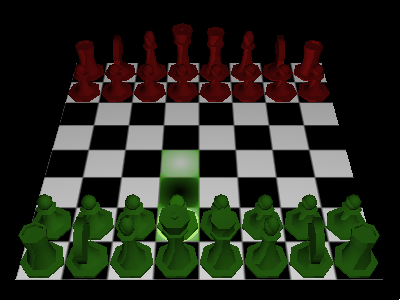
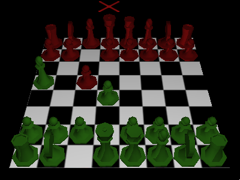
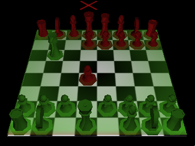

# Computer Graphics 1 Project

This project was made for the module Computer Graphics 1.
This project is a software renderer build on CG1 uni-template code.
This project is a 3D chess game.
The game logic was provided by the template code.

## How to compile
Prerequisits:
* `gcc` or `clang`
* `make`
* `glfw3`
* (uses `glad`, but already provided)

How to compile:
* Clone repository `git clone`
* `cd frameworkcg1`
* `make build`

How to run:
* `make run`

## Controls

- F1	-	show controls in terminal
- F2	-	create screenshot (screenshot.tga)
- F3	-	toggle wirframe-mode on/off
- F4	-	toggle back-face-culling on/off
- F5	-	switch between orhogonal and perspective projection
- W/A/S/D	-	turn forward/left/back/right
- c	-	change between gouraud and phong shading
- k	-	change to AI enemy
- r	-	restart game
- p	-	toggle FPS-controls on/off
- scrollwheel	-	zoom in/out

Left click the chess piece you want to move:

Either press right click to cancel the selection or left click the field you want to move to

If a red cross appears above a king piece the player is in check.

If the whole field turns green, green won, if the Field turns red red won:

